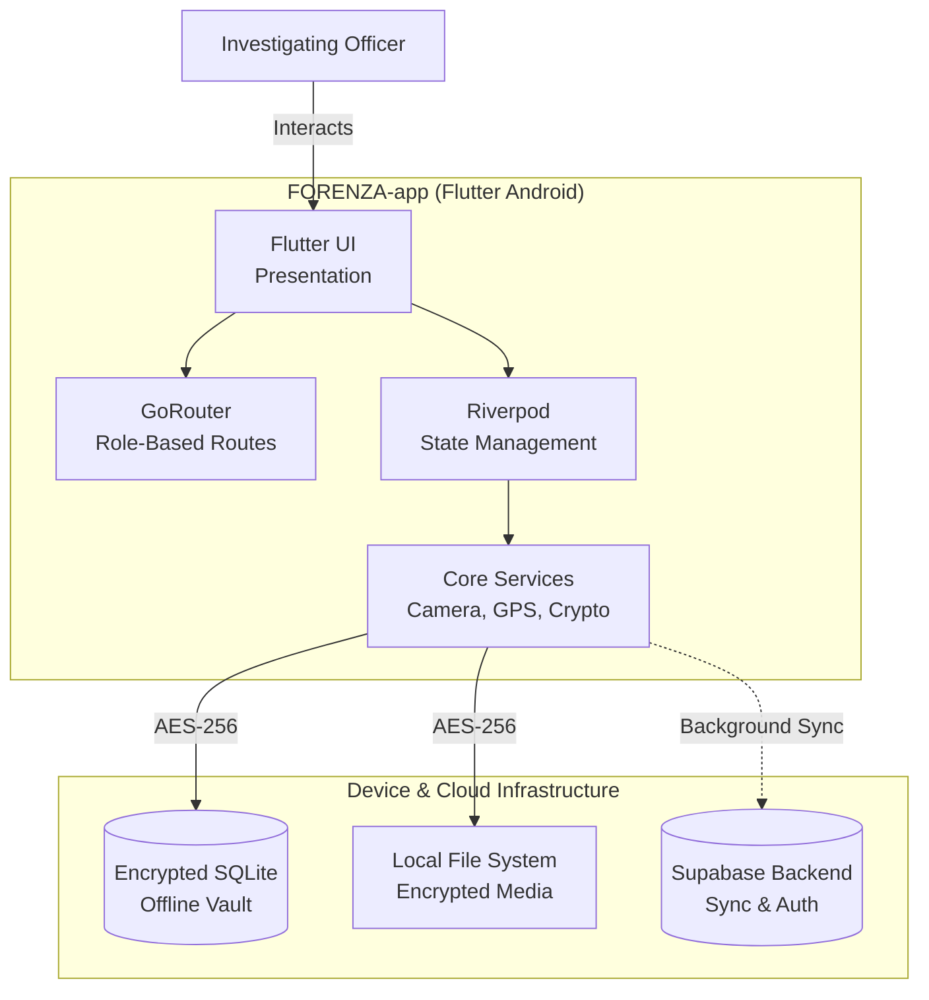

<div align="center">
  
  <h1>FORENZA Android Field Application</h1>
  <p><strong>Secure Evidence. Verified Chain. Defensible Truth.</strong></p>

  <p>
    <a href="#architecture"></a>
    <a href="#security"></a>
    <a href="#offline"></a>
    <a href="#ai"></a>
  </p>
</div>

---

## 📖 Overview
**FORENZA** is an Enterprise Forensic Evidence Platform designed to bridge the gap between field investigation and courtroom validation. 

This repository contains the **FORENZA Android Field Application**. Designed for Investigating Officers, it provides secure, offline-capable evidence capture, cryptographic integrity verification, and secure custody transfers directly from the crime scene.

> [!CAUTION]
> **LOCAL DEVELOPMENT ONLY:** This project is currently configured for academic demonstration and local testing. Do NOT deploy to production without executing the security checklists found in the `docs/` directory.

---

## 🏛️ System Architecture

The Android application utilizes a strict feature-driven architecture within Flutter, delegating offline persistence to encrypted SQLite and real-time syncing to the Supabase backend.



---

## 🔐 7-Role RBAC System Integration

While the web platform manages all 7 roles, the **Android App** is specifically tailored for field personnel. Access is controlled by JWT claims verified locally upon login.

| Supported Role | Primary Mobile Responsibility | Accessible Routes |
|----------------|-------------------------------|-------------------|
| **Investigating Officer** | Crime scene capture, AI review | `/officer/dashboard`, `/capture` |
| **Supervisor** | Field tracking, override approval | `/supervisor/dashboard` (Limited) |
| **Vault Custodian** | QR handover scanning | `/vault/scan` |

*For the complete granular permission matrix, see [`docs/RBAC_PERMISSION_MATRIX.md`](docs/RBAC_PERMISSION_MATRIX.md).*

---

## 🔗 Key Capabilities

### 1. Cryptographic Capture
Evidence integrity is paramount. FORENZA utilizes **SHA-256 hashing at the exact moment of capture** (before the image is even saved to disk). This guarantees that the binary data has not been altered by malicious device software.

### 2. Offline Vault (Air-Gapped Operation)
Officers often operate in cellular dead zones. The app features an **Offline Vault** utilizing AES-256-GCM encryption. Evidence is safely stored locally and synchronized idempotently via a background queue when connectivity is restored.

### 3. Chain of Custody (QR)
Transferring physical evidence from an Officer to the Vault Custodian is secured via encrypted QR handshakes. The app generates a cryptographic token representing the transfer intent, which the Custodian scans to finalize the chain.

> [!WARNING]
> All AI output provided during capture is strictly labeled as **AI-ASSISTED** and requires manual confirmation by the officer.

---

## 🛠️ Local Development Setup

To run the Android app locally for demonstration:

1. **Install Dependencies:**
   ```bash
   flutter pub get
   ```
2. **Configure Environment:**
   Copy `.env.example` to `.env` and populate the keys.
   *(Requires Supabase and local network configuration)*
3. **Run on Device / Emulator:**
   ```bash
   flutter run
   ```

---

## 📚 Comprehensive Documentation

The `docs/` folder contains professional, detailed documentation of the system's architecture, security, and algorithms:

- 🏗️ **Architecture & Setup:** [File Structure](docs/FILE_STRUCTURE.md) \| [Local Dev](docs/LOCAL_DEVELOPMENT.md) \| [Env Config](docs/ENVIRONMENT_CONFIGURATION.md)
- 🔒 **Security:** [Security Audit](docs/ANDROID_SECURITY.md) \| [Threat Model](docs/ANDROID_THREAT_MODEL.md)
- 📊 **Workflows:** [Evidence Lifecycle](docs/EVIDENCE_LIFECYCLE_AND_INTEGRITY.md) \| [RBAC Matrix](docs/RBAC_PERMISSION_MATRIX.md)

---

<div align="center">
  <p><em>Developed for Academic Demonstration & Future Deployment</em></p>
</div>
