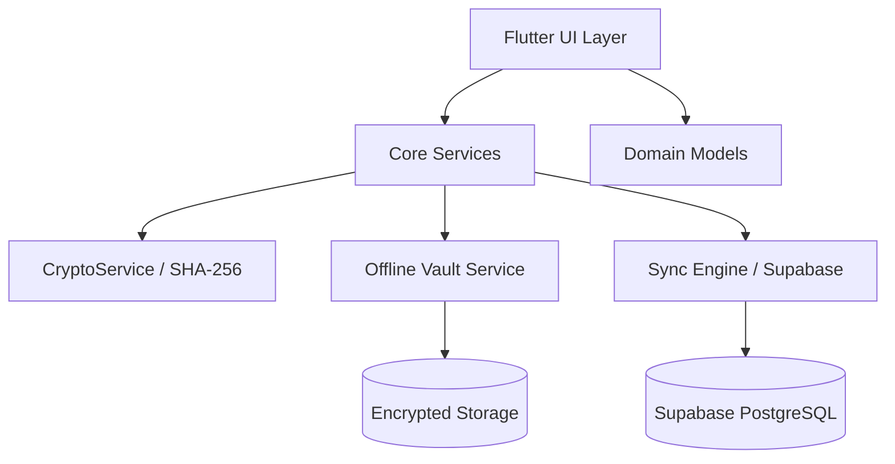

# Android Architecture

## Overview
FORENZA-app uses a feature-based architecture within the `lib/` directory.

## Core Modules
- **CryptoService**: Handles canonical JSON serialization and SHA-256 hashing.
- **OfflineVaultService**: Manages the local AES-256 encrypted evidence vault.
- **SyncService**: Reconciles the offline vault with the remote Supabase database when network is available.
