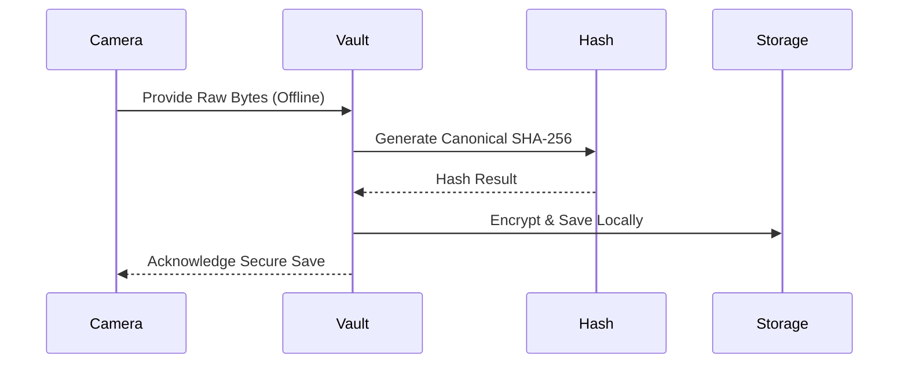

# Offline Evidence Workflow

The FORENZA field application is built *offline-first*.

## Data Flow

When network is restored, the `SyncService` pulls all `syncPending` evidence and uploads them to Supabase, then marks them as `serverVerified`.
