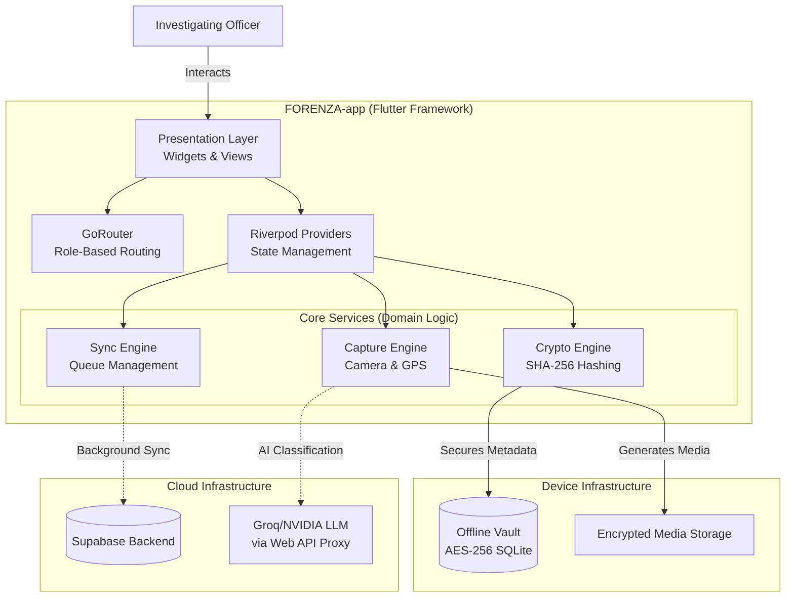

# FORENZA-app System Architecture

## Architectural Overview
The FORENZA Android Field Application utilizes a strict Feature-Driven Architecture within Flutter. It decouples the Presentation (UI) from Business Logic (Core Services), delegating absolute authority for offline persistence to an encrypted SQLite vault and real-time syncing to the Supabase backend.

## Key Architectural Decisions

### 1. Offline-First Design
Field officers often operate in zero-connectivity environments (e.g., deep inside buildings, rural areas). The `Offline Vault` is the absolute source of truth for the mobile application. The `SyncEngine` acts strictly as an idempotent background worker that drains the queue when connectivity is restored.

### 2. Immutability at Capture
The `CryptoEngine` intercepts the binary image data *before* it is written to the device storage, calculating the SHA-256 hash in volatile memory. This guarantees that the hash recorded in the database exactly matches the optical capture, defeating attempts to swap the image on disk.

### 3. State Decoupling
By heavily utilizing `Riverpod`, UI components never mutate data directly. They listen to streams (e.g., Sync Progress, Vault Inventory) provided by the Core Services, ensuring the UI always reflects the true system state without race conditions.
