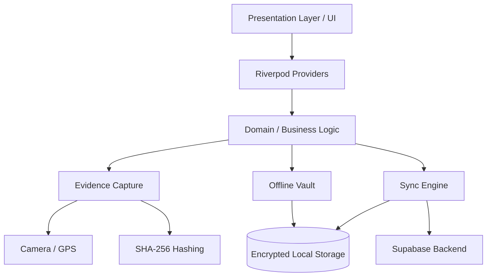

# FORENZA Android Architecture

## Overview
FORENZA-app is a native Android application built with Flutter and Dart. It operates as the secure field-client for forensic officers to capture, vault, and sync digital evidence.

## Technology Stack
- **Framework:** Flutter (>=3.16.0)
- **Language:** Dart (>=3.2.0)
- **State Management:** Riverpod (`flutter_riverpod`)
- **Routing:** GoRouter (`go_router`)
- **Backend Communication:** Supabase SDK (`supabase_flutter`), HTTP (`http`)
- **Local Vault / Storage:** Shared Preferences (`shared_preferences`), Path Provider (`path_provider`)
- **Hardware Integration:** Camera (`camera`), Geolocator (`geolocator`), QR Scanner (`mobile_scanner`)
- **Cryptography:** Crypto (`crypto` for SHA-256)

## System Architecture

## Layers

### 1. Presentation Layer (`lib/screens/`)
Handles the UI rendering using Material Design and custom brand guidelines. Uses `LucideIcons` and `GoogleFonts` (Inter/Roboto variants). Routing is strictly handled by `GoRouter` mapping screens to paths.

### 2. State Management (`Riverpod`)
The app uses providers to manage authentication state, sync progress, and vault inventory. This decoupling ensures UI components only react to state changes without mutating data directly.

### 3. Core Services (`lib/core/services/`)
- `api_service.dart`: Handles backend connectivity.
- `crypto_service.dart`: Responsible for generating evidence signatures (SHA-256).
- `geofence_service.dart`: Retrieves and validates GPS bounds.
- `offline_vault_service.dart`: Manages encrypted offline local storage.
- `sync_engine.dart`: Orchestrates pushing offline evidence to the server.

### 4. Data Layer / Models (`lib/models/`)
Contains immutable data structures like `evidence_model.dart` that strictly map to the Web/Supabase database schema.
