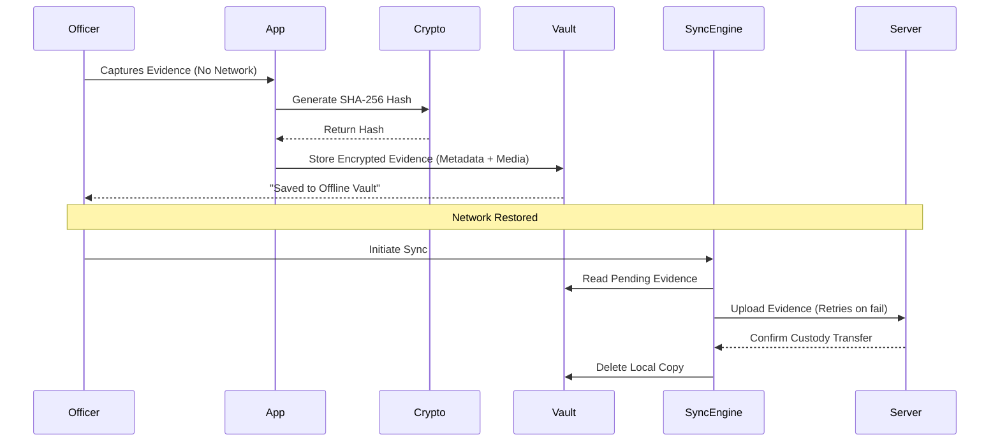

# FORENZA Android Offline Workflow

## Offline Capabilities
FORENZA-app is explicitly designed to operate in completely disconnected environments (e.g., deep inside buildings, rural areas, or secure bunkers). 

## The Offline Vault

When connectivity is lost or disabled, captured evidence bypasses the immediate network upload queue and is routed to the **Offline Vault**.

### Encryption
Data stored in the Offline Vault is encrypted using device-local storage policies. Due to the sensitive nature of the evidence, the physical device boundary is treated as a zero-trust zone.

## Synchronization
The `SyncEngine` (`lib/core/services/sync_engine.dart`) handles moving data from the vault to the server.

### Features
1. **Idempotency**: Prevents duplicate uploads of the same evidence.
2. **Hash Verification**: The SHA-256 hash generated offline is pushed to the server. The server independently verifies the hash. If modified in transit, the upload is rejected.
3. **Queue Clearance**: Once the server explicitly acknowledges receipt and custody transfer, the `SyncEngine` securely purges the evidence from the local device to prevent data leakage.
