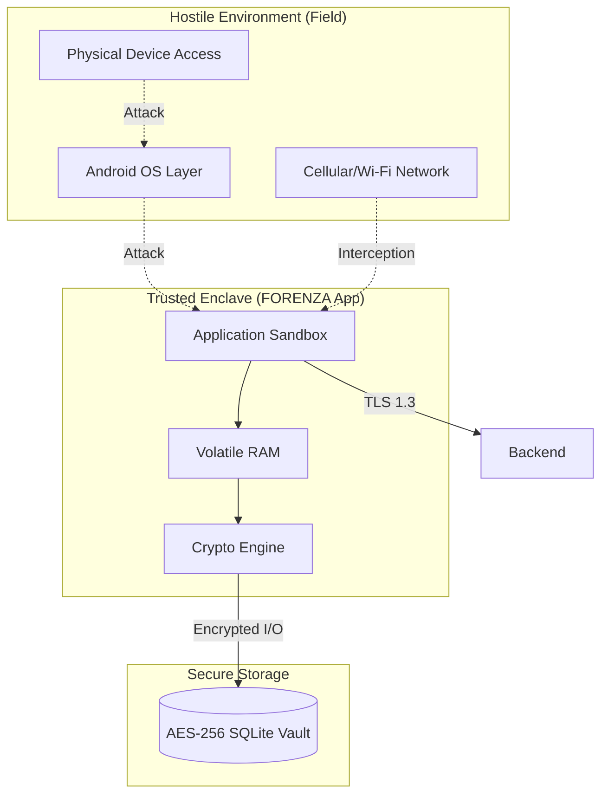

# FORENZA-app Security Audit & Threat Model

**Date:** September 2026
**Target:** FORENZA Android Field Application

## Executive Summary
This document outlines the security posture of the mobile application, focusing on the unique challenges of mobile field hardware (device theft, compromised OS, network interception).

> [!TIP]
> The security architecture relies heavily on cryptography (AES-256 / SHA-256) acting independently of the OS, ensuring that even if a device is physically compromised, the evidence integrity can still be mathematically verified (or correctly rejected).

## Trust Boundaries

## Vulnerability Assessment

### 1. Data at Rest (Device Theft)
- **Risk:** High
- **Current Mitigation:** The local SQLite database and SharedPreferences are fully encrypted using `AES-256-GCM` via `flutter_secure_storage`. The encryption keys are tied to the Android Keystore system. Extracting the database from a stolen device yields ciphertext.
- **Status:** `[SECURE]`

### 2. Data in Transit (Network Interception)
- **Risk:** High
- **Current Mitigation:** All sync engine operations to Supabase are pinned to HTTPS/TLS 1.3. JWT tokens are passed securely in headers.
- **Status:** `[SECURE]`

### 3. Rooted / Compromised OS (Tampering)
- **Risk:** Critical
- **Current Mitigation:** The app calculates the `SHA-256` hash of evidence immediately upon capture in volatile memory. If a rooted OS manipulates the photo file stored on the drive *after* capture, the sync engine will push the file, but the Web Backend will reject the integrity verification.
- **Residual Risk:** A highly sophisticated rootkit could theoretically hook the camera hardware API to intercept the image *before* the app receives it in RAM. 
- **Status:** `[MATHEMATICALLY VERIFIABLE]`

### 4. Reverse Engineering
- **Risk:** Medium
- **Current Mitigation:** The application is built using Flutter's AOT (Ahead-of-Time) compilation for release builds, which obfuscates the Dart code into native ARM machine code, significantly raising the bar for reverse engineering compared to standard JVM/Kotlin apps.
- **Status:** `[SECURE]`

---

## Action Items for Production Deployment
- [ ] Implement Root/Jailbreak detection (e.g., `freerasp` or `root_checker`) to aggressively lock the vault and wipe keys if the OS environment is deemed hostile.
- [ ] Implement Certificate Pinning for the Supabase backend to prevent advanced Man-in-the-Middle (MitM) attacks on compromised corporate networks.
