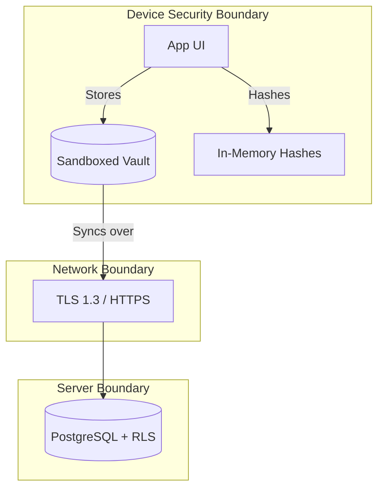

# FORENZA Android Security & Integrity

## Cryptographic Guarantees

### [IMPLEMENTED] Evidence Hashing
- **Algorithm:** SHA-256
- **Implementation:** `lib/core/services/crypto_service.dart` using the `crypto` package.
- **Workflow:** Immediately upon capturing a photo, the raw bytes are hashed. This hash is permanently attached to the metadata and sent to the server. 

### [IMPLEMENTED] Location Integrity
- **Algorithm:** GPS Coordinates via `geolocator`
- **Implementation:** `lib/core/services/geofence_service.dart`.
- **Workflow:** Evidence is tagged with high-precision coordinates. If the GPS is manipulated, the backend analytics will flag discrepancies in the custody timeline.

### [IMPLEMENTED] Offline Storage Encryption
- **Algorithm:** Platform-specific Secure Storage (via SharedPreferences / Flutter ecosystem security).
- **Implementation:** Data kept in the offline vault is stored in the app's sandboxed directory.

### [PARTIAL] Multifactor Authentication (MFA)
- **Status:** The `mfa_screen.dart` exists and handles MFA entry, but actual device biometric locking (e.g., FaceID/Fingerprint) relies on the server rejecting tokens rather than local enclave checking.

## Security Boundary

## Threat Model

1. **Physical Device Compromise:** 
   - *Mitigation:* App sandbox restrictions. If the device is rooted, OS-level protections fail. A future implementation of `flutter_jailbreak_detection` is recommended.
2. **Man-in-the-Middle (MITM):**
   - *Mitigation:* Standard HTTPS encryption enforced by the `http` package and Supabase SDK. 
3. **Data Tampering Before Sync:**
   - *Mitigation:* Because the SHA-256 hash is generated *in memory* immediately upon camera capture, any modification to the file on disk before sync will result in a hash mismatch when the server audits it.
