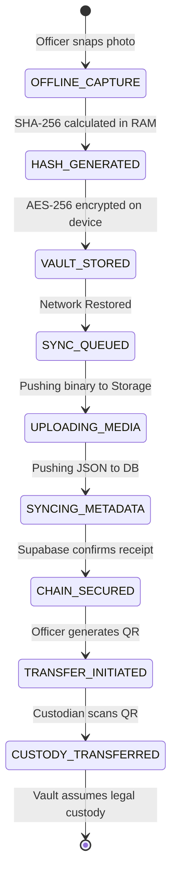
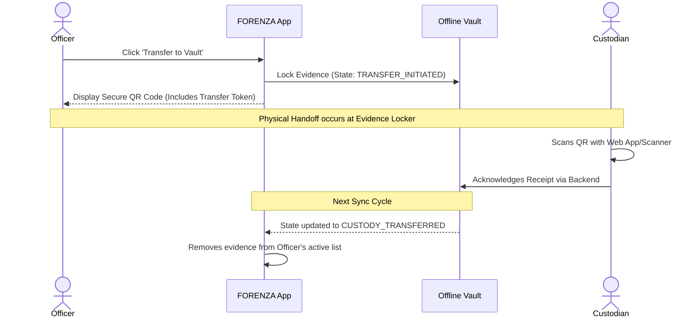

# FORENZA-app Evidence Lifecycle & Integrity

The Chain of Custody and cryptographically verified integrity are the most critical components of the FORENZA platform. This document outlines the physical and digital lifecycle of evidence captured on the mobile app.

## Evidence State Machine

## The Cryptographic Guarantee

> [!IMPORTANT]
> Evidence is legally useless if it can be repudiated. FORENZA provides mathematically defensible evidence integrity.

1. **In-Memory Hashing:** The moment the camera shutter triggers, the binary blob is hashed (SHA-256) in RAM.
2. **Metadata Canonicalization:** The GPS coordinates, compass heading, timestamp (from GPS, not device clock), and the media hash are combined into a canonical JSON string.
3. **Master Hash:** A final SHA-256 hash is generated over the canonical metadata string.
4. **Offline Sealing:** This master hash is written to the encrypted SQLite database.

If a malicious actor roots the Android device and alters the photo file on the storage drive, the `master_hash` will fail verification during the upload process because the altered file's hash will not match the hash sealed in the metadata.

## QR Chain of Custody Handoff

