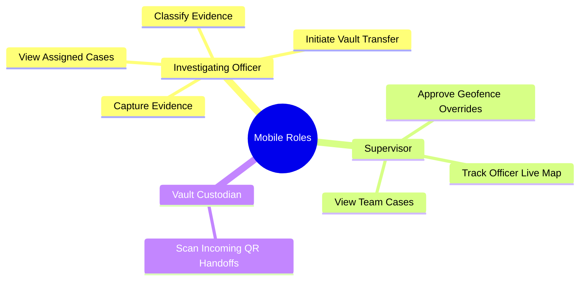

# FORENZA-app RBAC Permission Matrix

This document defines the Role-Based Access Control (RBAC) matrix for the Android Application, focusing purely on field operations. 

> [!IMPORTANT]
> The Android app handles only 3 of the 7 FORENZA roles. Roles like `JUDGE`, `AUDITOR`, and `LAB_ANALYST` are entirely restricted to the Web Application.

## Mobile Role Definitions

## Mobile Application Access Matrix

| Module / Screen | Officer | Supervisor | Vault Custodian |
|-----------------|---------|------------|-----------------|
| **Login / Sync Center** | ✓ | ✓ | ✓ |
| **Active Cases (Assigned)** | ✓ | ✓ (All Team) | ❌ |
| **Evidence Capture (Camera)** | ✓ | ❌ | ❌ |
| **AI Classification UI** | ✓ | ❌ | ❌ |
| **Initiate Custody Transfer (Show QR)**| ✓ | ❌ | ❌ |
| **Receive Custody Transfer (Scan QR)** | ❌ | ❌ | ✓ |
| **Geofence Override Requests** | Request | Approve | ❌ |
| **Live Map Tracking** | Transmit Location | View Team Location | ❌ |

## Security Enforcement

The mobile application enforces these roles via **Client-Side Routing Guards** implemented in `GoRouter`. 
When a user logs in, the `AuthService` extracts their `AppRole` from the JWT/Profile.

If a `Vault Custodian` attempts to navigate to the Evidence Capture screen, the router instantly deflects them back to their authorized dashboard.

*Note: True security remains on the backend. Even if the UI is hacked, Supabase RLS will reject an evidence insertion attempt from a user without the `INVESTIGATING_OFFICER` role.*
